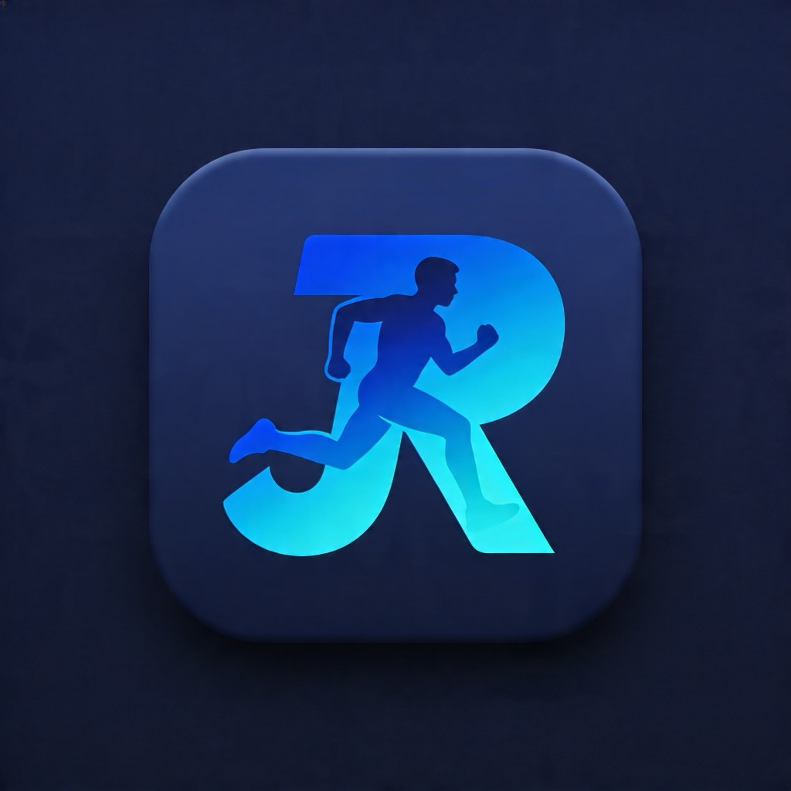

<p align="center">
  
</p>

# Journal de Sport (jr_sport)

Application iOS native (SwiftUI) pour suivre ses séances de musculation : exercices, séries, charges, et progression au fil du temps.

## Stack

- **Swift 5.9** / **SwiftUI**
- **iOS 17+**
- **Xcode 15**
- Génération du projet via [XcodeGen](https://github.com/yonaskolb/XcodeGen) (`project.yml`)

## Structure

```
mobile_app_sport/
├── jr_sport/
│   ├── jr_sportApp.swift        # Point d'entrée de l'app
│   ├── Theme.swift              # Thème / styles
│   ├── Assets.xcassets          # Couleurs, icônes
│   ├── Models/
│   │   ├── WorkoutModels.swift  # Modèles de données (exercices, séries…)
│   │   └── WorkoutStore.swift   # Store observable
│   └── Views/
│       ├── ContentView.swift
│       ├── ExerciseListView.swift
│       ├── ExerciseDetailView.swift
│       ├── AddExerciseView.swift
│       └── AddSessionView.swift
├── data/                        # Données CSV de référence
├── project.yml                  # Spec XcodeGen
└── run.sh                       # Build + install + launch sur simulateur
```

## Lancer l'app

### Prérequis
- macOS avec Xcode 15+
- Simulateur iOS 17+ installé
- (Optionnel) [XcodeGen](https://github.com/yonaskolb/XcodeGen) si tu modifies `project.yml`

### En une commande

```bash
./run.sh                  # Lance sur "iPhone 17 Pro" par défaut
./run.sh "iPhone 15"      # Sur un simulateur spécifique
```

Le script :
1. Régénère le `xcodeproj` si `project.yml` a changé
2. Boote le simulateur
3. Build l'app en Debug
4. L'installe et la lance

### Depuis Xcode

```bash
open jr_sport.xcodeproj
```

Puis ⌘R.

## Données

Le fichier `data/Muscu2026 - Feuille 1-2.csv` contient les exercices/séances de référence importés dans l'app.

## Licence

Projet personnel.
